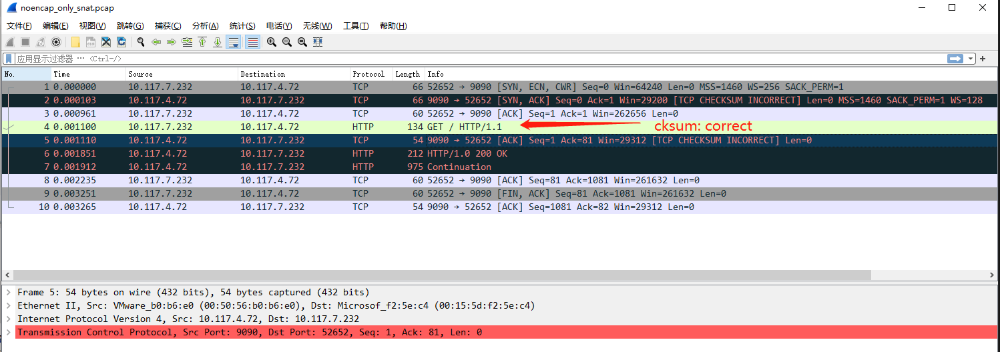
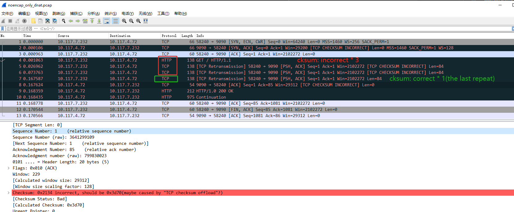

## TOPO

- SNAT: (192.168.1.1, 10.117.4.72:9090)  ==> gw: SNAT(10.117.7.232, 10.117.4.72:9090)
- DNAT: (10.117.7.232, 192.168.100.100:9090)  ==> br-int: DNAT(10.117.7.232, 10.117.4.72:9090)

Linux Server: 10.117.4.72:9090
br-int: 10.117.7.232
gw: 192.168.1.1
VirtualServer: 192.168.100.100:9090

``` powershell
New-HNSNetwork -name external -AddressPrefix 192.168.1.0/24 -Gateway 192.168.1.1 -type Transparent -AdapterName Ethernet1

$net = Get-HnsNetwork | Where-Object {$_.Type -eq "transparent"}
Enable-OVSOnHNSNetwork $net.ID

$UplinkMacSrc=$(Get-NetAdapter Ethernet1).MacAddress
$UplinkMacNoColon=($UplinkMacSrc -replace "-","")
$UplinkMac=($UplinkMacSrc -replace "-",":")
$UplinkPort="1"


Get-VMSwitch -Name external  | Set-VMSwitch -AllowManagementOS $false
Get-VMSwitch -Name external  | Set-VMSwitch -AllowManagementOS $false

ovs-vsctl --no-wait add-br br-int

# Take affect after enable br-int
Set-NetAdapterAdvancedProperty -Name br-int -RegistryKeyword NetworkAddress -RegistryValue $UplinkMac

Enable-NetAdapter br-int

ovs-vsctl --no-wait add-port br-int Ethernet1 -- set interface Ethernet1 ofport_request=$UplinkPort

$UplinkIP="10.117.7.232"

$GwName="gw"
$GwIP="192.168.1.1"
$GwPort="2"


ovs-vsctl --no-wait add-port br-int $GwName -- set interface gw type=internal ofport_request=$GwPort
Enable-NetAdapter -InterfaceAlias $GwName
Set-NetIPInterface -InterfaceAlias $GwName -Dhcp Disabled
New-NetIPAddress -InterfaceAlias $GwName -IPAddress $GwIP -PrefixLength 24

$GwMacSrc=$(Get-NetAdapter $GwName).MacAddress
$GwMac=($GwMacSrc -replace "-",":")

$ServerIP="10.117.4.72"
$ServerIPHex="0xA750448"
$ServerMac="00:50:56:b0:b6:e0"
$ServerMacHex="0x005056b0b6e0"

$ClassifierTable=0
$ARPResponderTable=0
$CTTable=1
$ForwardTable=2
$CTZone=65520
$Cookie="cookie=0x198"


ovs-ofctl add-flow br-int "table=0,priority=100,in_port=$UplinkPort actions=LOCAL"
ovs-ofctl add-flow br-int "table=0,priority=100,in_port=LOCAL actions=$UplinkPort"

```

## SNAT Only Test

SNAT: (192.168.1.1, 10.117.4.72:9090)  ==> gw: SNAT(10.117.7.232, 10.117.4.72:9090)

``` powershell

New-NetRoute -InterfaceAlias $GwName -DestinationPrefix $ServerIP/32 -NextHop $ServerIP

ovs-ofctl.exe del-flows br-int "cookie=0x198/-1"

ovs-ofctl add-flow br-int "table=$ClassifierTable, $Cookie,priority=200,arp,arp_tpa=$ServerIP,arp_op=1 actions=move:NXM_OF_ETH_SRC[]->NXM_OF_ETH_DST[],mod_dl_src:$ServerMac,load:0x2->NXM_OF_ARP_OP[],move:NXM_NX_ARP_SHA[]->NXM_NX_ARP_THA[],load:$ServerMacHex->NXM_NX_ARP_SHA[],move:NXM_OF_ARP_SPA[]->NXM_OF_ARP_TPA[],load:$ServerIPHex->NXM_OF_ARP_SPA[],IN_PORT"


ovs-ofctl add-flow br-int "table=$ClassifierTable, $Cookie,priority=180,in_port=$GwPort,ip,nw_src=$GwIP,nw_dst=$ServerIP actions=ct(table=$CTTable,zone=$CTZone,nat)"
ovs-ofctl add-flow br-int "table=$ClassifierTable, $Cookie,priority=180,in_port=$UplinkPort,ip,nw_src=$ServerIP,nw_dst=$UplinkIP actions=ct(table=$CTTable,zone=$CTZone,nat)"


ovs-ofctl add-flow br-int "table=$CTTable, $Cookie, priority=180, ct_state=+new+trk,ip,in_port=$GwPort,nw_src=$GwIP,nw_dst=$ServerIP actions=ct(commit,table=$ForwardTable,zone=$CTZone,nat(src=$UplinkIP))"
ovs-ofctl add-flow br-int "table=$CTTable, $Cookie, priority=180, ct_state=-new+trk,ip actions=resubmit(,$ForwardTable)"
ovs-ofctl add-flow br-int "table=$CTTable, $Cookie,priority=0 actions=drop"

ovs-ofctl add-flow br-int "table=$ForwardTable, $Cookie, priority=180,in_port=$GwPort,ip,nw_src=$UplinkIP,nw_dst=$ServerIP actions=mod_dl_src:$UplinkMac,output:$UplinkPort"
ovs-ofctl add-flow br-int "table=$ForwardTable, $Cookie, priority=180,in_port=$UplinkPort,ip,nw_src=$ServerIP,nw_dst=$GwIP actions=mod_dl_dst:$GwMac,output:$GwPort"
ovs-ofctl add-flow br-int "table=$ForwardTable, $Cookie,priority=0 actions=drop"


## Test
curl.exe 10.117.4.72:9090

```

Result: data/noencap_only_snat.pcap



## Add VirtualServer: vnic --<> VirtualServer(DNAT) --> ActualServer
``` powershell

$VIP="192.168.1.100"
$VIPHex="0xC0A80164"
$VIPMac="ff:ee:dd:cc:bb:aa"
$VIPMacHex="0xffeeddccbbaa"

ovs-ofctl.exe del-flows br-int "cookie=0x198/-1"

ovs-ofctl add-flow br-int "table=$ClassifierTable, $Cookie,priority=200,arp,arp_tpa=$VIP,arp_op=1 actions=move:NXM_OF_ETH_SRC[]->NXM_OF_ETH_DST[],mod_dl_src:aa:bb:cc:dd:ee:ff,load:0x2->NXM_OF_ARP_OP[],move:NXM_NX_ARP_SHA[]->NXM_NX_ARP_THA[],load:$VIPMacHex->NXM_NX_ARP_SHA[],move:NXM_OF_ARP_SPA[]->NXM_OF_ARP_TPA[],load:$VIPHex->NXM_OF_ARP_SPA[],IN_PORT"

ovs-ofctl add-flow br-int "table=$ClassifierTable, $Cookie,priority=180,in_port=$GwPort,ip,nw_src=$GwIP,nw_dst=$VIP actions=ct(table=$CTTable,zone=$CTZone,nat)"
ovs-ofctl add-flow br-int "table=$ClassifierTable, $Cookie,priority=180,in_port=$UplinkPort,ip,nw_src=$ServerIP,nw_dst=$UplinkIP actions=mod_nw_dst:$GwIP,ct(table=$CTTable,zone=$CTZone,nat)"


ovs-ofctl add-flow br-int "table=$CTTable, $Cookie, priority=180, ct_state=+new+trk,ip,in_port=$GwPort,nw_src=$GwIP,nw_dst=$VIP actions=ct(commit,table=$ForwardTable,zone=$CTZone,nat(dst=$ServerIP))"
ovs-ofctl add-flow br-int "table=$CTTable, $Cookie, priority=180, ct_state=-new+trk,ip actions=resubmit(,$ForwardTable)"
ovs-ofctl add-flow br-int "table=$CTTable, $Cookie,priority=0 actions=drop"

ovs-ofctl add-flow br-int "table=$ForwardTable, $Cookie, priority=180,in_port=$GwPort,ip,nw_src=$GwIP,nw_dst=$ServerIP actions=mod_nw_src:$UplinkIP,mod_dl_src:$UplinkMac,mod_dl_dst:$ServerMac,output:$UplinkPort"
ovs-ofctl add-flow br-int "table=$ForwardTable, $Cookie, priority=180,in_port=$UplinkPort,ip,nw_src=$VIP,nw_dst=$GwIP actions=mod_dl_dst:$GwMac,mod_dl_src:$VIPMac,output:$GwPort"
ovs-ofctl add-flow br-int "table=$ForwardTable, $Cookie,priority=0 actions=drop"

### Test2
curl.exe 192.168.1.100:9090
```

```
root@dev:~# tcpdump -i ens160 -ne  port 9090 -vvv
tcpdump: listening on ens160, link-type EN10MB (Ethernet), capture size 262144 bytes


04:43:50.796740 00:15:5d:f2:5e:c4 > 00:50:56:b0:b6:e0, ethertype IPv4 (0x0800), length 66: (tos 0x2,ECT(0), ttl 128, id 33089, offset 0, flags [DF], proto TCP (6), length 52)
    10.117.7.232.52187 > 10.117.4.72.9090: Flags [SEW], cksum 0x3ed5 (correct), seq 1190845720, win 64240, options [mss 1460,nop,wscale 8,nop,nop,sackOK], length 0
04:43:50.796840 00:50:56:b0:b6:e0 > 00:15:5d:f2:5e:c4, ethertype IPv4 (0x0800), length 66: (tos 0x0, ttl 64, id 0, offset 0, flags [DF], proto TCP (6), length 52)
    10.117.4.72.9090 > 10.117.7.232.52187: Flags [S.], cksum 0x2140 (incorrect -> 0x28b4), seq 3200966886, ack 1190845721, win 29200, options [mss 1460,nop,nop,sackOK,nop,wscale 7], length 0
04:43:50.797719 00:15:5d:f2:5e:c4 > 00:50:56:b0:b6:e0, ethertype IPv4 (0x0800), length 60: (tos 0x0, ttl 128, id 33090, offset 0, flags [DF], proto TCP (6), length 40)
    10.117.7.232.52187 > 10.117.4.72.9090: Flags [.], cksum 0xbb82 (correct), seq 1, ack 1, win 8212, length 0
04:43:50.797792 00:15:5d:f2:5e:c4 > 00:50:56:b0:b6:e0, ethertype IPv4 (0x0800), length 134: (tos 0x0, ttl 128, id 33091, offset 0, flags [DF], proto TCP (6), length 120)
    10.117.7.232.52187 > 10.117.4.72.9090: Flags [P.], cksum 0x1285 (correct), seq 1:81, ack 1, win 8212, length 80
04:43:50.797806 00:50:56:b0:b6:e0 > 00:15:5d:f2:5e:c4, ethertype IPv4 (0x0800), length 54: (tos 0x0, ttl 64, id 17941, offset 0, flags [DF], proto TCP (6), length 40)
    10.117.4.72.9090 > 10.117.7.232.52187: Flags [.], cksum 0x2134 (incorrect -> 0xda61), seq 1, ack 81, win 229, length 0
04:43:50.798728 00:50:56:b0:b6:e0 > 00:15:5d:f2:5e:c4, ethertype IPv4 (0x0800), length 212: (tos 0x0, ttl 64, id 17942, offset 0, flags [DF], proto TCP (6), length 198)
    10.117.4.72.9090 > 10.117.7.232.52187: Flags [P.], cksum 0x21d2 (incorrect -> 0x1080), seq 1:159, ack 81, win 229, length 158
04:43:50.798800 00:50:56:b0:b6:e0 > 00:15:5d:f2:5e:c4, ethertype IPv4 (0x0800), length 834: (tos 0x0, ttl 64, id 17943, offset 0, flags [DF], proto TCP (6), length 820)
    10.117.4.72.9090 > 10.117.7.232.52187: Flags [FP.], cksum 0x2440 (incorrect -> 0xdc3c), seq 159:939, ack 81, win 229, length 780
04:43:50.799109 00:15:5d:f2:5e:c4 > 00:50:56:b0:b6:e0, ethertype IPv4 (0x0800), length 60: (tos 0x0, ttl 128, id 33092, offset 0, flags [DF], proto TCP (6), length 40)
    10.117.7.232.52187 > 10.117.4.72.9090: Flags [.], cksum 0xb78b (correct), seq 81, ack 940, win 8208, length 0
04:43:50.799975 00:15:5d:f2:5e:c4 > 00:50:56:b0:b6:e0, ethertype IPv4 (0x0800), length 60: (tos 0x0, ttl 128, id 33093, offset 0, flags [DF], proto TCP (6), length 40)
    10.117.7.232.52187 > 10.117.4.72.9090: Flags [F.], cksum 0xb78a (correct), seq 81, ack 940, win 8208, length 0
04:43:50.799995 00:50:56:b0:b6:e0 > 00:15:5d:f2:5e:c4, ethertype IPv4 (0x0800), length 54: (tos 0x0, ttl 64, id 0, offset 0, flags [DF], proto TCP (6), length 40)
    10.117.4.72.9090 > 10.117.7.232.52187: Flags [.], cksum 0xd6b5 (correct), seq 940, ack 82, win 229, length 0

```


##  DNAT only test(Deprecated)

``` powershell

$VIP="192.168.100.100"
$VIPHex="0xC0A80164"
$VIPMac="ff:ee:dd:cc:bb:aa"
$VIPMacHex="0xffeeddccbbaa"

New-NetRoute -InterfaceAlias br-int -DestinationPrefix $VIP/32 -NextHop $VIP

ovs-ofctl.exe del-flows br-int "cookie=0x198/-1"


ovs-ofctl add-flow br-int "table=$ClassifierTable, $Cookie,priority=200,arp,arp_tpa=$VIP,arp_op=1 actions=move:NXM_OF_ETH_SRC[]->NXM_OF_ETH_DST[],mod_dl_src:aa:bb:cc:dd:ee:ff,load:0x2->NXM_OF_ARP_OP[],move:NXM_NX_ARP_SHA[]->NXM_NX_ARP_THA[],load:$VIPMacHex->NXM_NX_ARP_SHA[],move:NXM_OF_ARP_SPA[]->NXM_OF_ARP_TPA[],load:$VIPHex->NXM_OF_ARP_SPA[],IN_PORT"

ovs-ofctl add-flow br-int "table=$ClassifierTable, $Cookie,priority=180,in_port=LOCAL,ip,nw_src=$UplinkIP,nw_dst=$VIP actions=ct(table=$CTTable,zone=$CTZone,nat)"
ovs-ofctl add-flow br-int "table=$ClassifierTable, $Cookie,priority=180,in_port=$UplinkPort,ip,nw_src=$ServerIP,nw_dst=$UplinkIP actions=mod_nw_dst:$GwIP,ct(table=$CTTable,zone=$CTZone,nat)"


ovs-ofctl add-flow br-int "table=$CTTable, $Cookie, priority=180, ct_state=+new+trk,ip,in_port=LOCAL,nw_src=$UplinkIP,nw_dst=$VIP actions=ct(commit,table=$ForwardTable,zone=$CTZone,nat(dst=$ServerIP))"
ovs-ofctl add-flow br-int "table=$CTTable, $Cookie, priority=180, ct_state=-new+trk,ip actions=resubmit(,$ForwardTable)"
ovs-ofctl add-flow br-int "table=$CTTable, $Cookie,priority=0 actions=drop"

ovs-ofctl add-flow br-int "table=$ForwardTable, $Cookie, priority=180,in_port=LOCAL,ip,nw_src=$UplinkIP,nw_dst=$ServerIP actions=mod_dl_dst:$ServerMac,output:$UplinkPort"
ovs-ofctl add-flow br-int "table=$ForwardTable, $Cookie, priority=180,in_port=$UplinkPort,ip,nw_src=$VIP,nw_dst=$UplinkIP actions=mod_dl_src:$GwMac,output:LOCAL"
ovs-ofctl add-flow br-int "table=$ForwardTable, $Cookie,priority=0 actions=drop"

### Test2
curl.exe 192.168.100.100:9090
```

##  DNAT only test

```

- DNAT: (10.117.7.232, 192.168.100.100:9090)  ==> br-int: DNAT(10.117.7.232, 10.117.4.72:9090)


- Req: (10.117.7.232, 192.168.100.100:9090) --> br-int --> OVS --> DNAT(10.117.7.232, 10.117.4.72:9090) --> Uplink --> external network  --> Linux Server

Linux Server: 10.117.4.72:9090
br-int: 10.117.7.232
gw: 192.168.1.1
VirtualServer: 192.168.100.100:9090
```


``` powershell

$VIP="192.168.100.100"
$VIPHex="0xC0A86464"
$VIPMac="ff:ee:dd:cc:bb:aa"
$VIPMacHex="0xffeeddccbbaa"

New-NetRoute -InterfaceAlias br-int -DestinationPrefix $VIP/32 -NextHop $VIP

ovs-ofctl.exe del-flows br-int "cookie=0x198/-1"


ovs-ofctl add-flow br-int "table=$ClassifierTable, $Cookie,priority=200,arp,arp_tpa=$VIP,arp_op=1 actions=move:NXM_OF_ETH_SRC[]->NXM_OF_ETH_DST[],mod_dl_src:$ServerMac,load:0x2->NXM_OF_ARP_OP[],move:NXM_NX_ARP_SHA[]->NXM_NX_ARP_THA[],load:$ServerMacHex->NXM_NX_ARP_SHA[],move:NXM_OF_ARP_SPA[]->NXM_OF_ARP_TPA[],load:$VIPHex->NXM_OF_ARP_SPA[],IN_PORT"

ovs-ofctl add-flow br-int "table=$ClassifierTable, $Cookie,priority=180,in_port=LOCAL,ip,nw_src=$UplinkIP,nw_dst=$VIP actions=ct(table=$CTTable,zone=$CTZone,nat)"
ovs-ofctl add-flow br-int "table=$ClassifierTable, $Cookie,priority=180,in_port=$UplinkPort,ip,nw_src=$ServerIP,nw_dst=$UplinkIP actions=ct(table=$CTTable,zone=$CTZone,nat)"


ovs-ofctl add-flow br-int "table=$CTTable, $Cookie, priority=180, ct_state=+new+trk,ip,in_port=LOCAL,nw_src=$UplinkIP,nw_dst=$VIP actions=ct(commit,table=$ForwardTable,zone=$CTZone,nat(dst=$ServerIP))"
ovs-ofctl add-flow br-int "table=$CTTable, $Cookie, priority=180, ct_state=-new+trk,ip actions=resubmit(,$ForwardTable)"
ovs-ofctl add-flow br-int "table=$CTTable, $Cookie,priority=0 actions=drop"

ovs-ofctl add-flow br-int "table=$ForwardTable, $Cookie, priority=180,in_port=LOCAL,ip,nw_src=$UplinkIP,nw_dst=$ServerIP actions=output:$UplinkPort"
ovs-ofctl add-flow br-int "table=$ForwardTable, $Cookie, priority=180,in_port=$UplinkPort,ip,nw_src=$VIP,nw_dst=$UplinkIP actions=output:LOCAL"
ovs-ofctl add-flow br-int "table=$ForwardTable, $Cookie,priority=0 actions=drop"

### Test2
curl.exe 192.168.100.100:9090
```

Result: data/noencap_only_dnat.pcap

