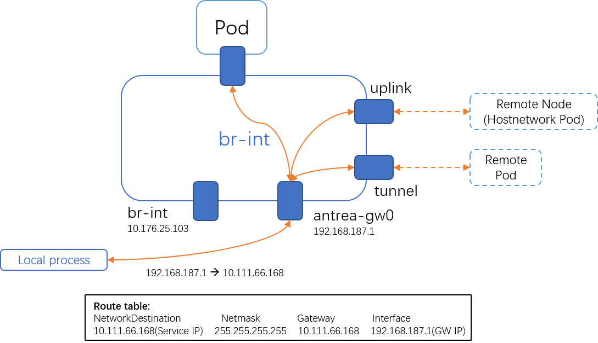

## ClusterIP SVC

Currently, 

With kube-proxy disabled:
1. Pod --> SVC (AntreaProxy)
2. On Windows node --> SVC (Kube-proxy)   <======== We propose to remove the kube-proxy dependency.

### Design overview



``` powershell
# 1. Add route svcIP.nexthop = self, iface=gw
$SVCIP="10.111.66.168"
$GwIP="192.168.187.1"
New-NetRoute -InterfaceAlias antrea-gw0 -DestinationPrefix $SVCIP/32 -NextHop $SGWIP

# 2. Add arp respondor for svcip
$SVCIPHex="0xA614DF1" # 10.111.43.196
$GwMac="00:15:5D:1A:D4:0D"
$GwMacHex="0x00155D1AD40D"
$Cookie="0x520"

# 3. ARP respondor flow for SVCIP
ovs-ofctl add-flow br-int "table=10,cookie=$Cookie,priority=210,arp,arp_tpa=$SVCIP,arp_op=1 actions=move:NXM_OF_ETH_SRC[]->NXM_OF_ETH_DST[],mod_dl_src:$GwMac,load:0x2->NXM_OF_ARP_OP[],move:NXM_NX_ARP_SHA[]->NXM_NX_ARP_THA[],load:$GwMacHex->NXM_NX_ARP_SHA[],move:NXM_OF_ARP_SPA[]->NXM_OF_ARP_TPA[],load:$SVCIPHex->NXM_OF_ARP_SPA[],IN_PORT"

# 4. Add flows on only for hostnetwork mode endpoints.
# By current pipeline, match req pkt match:
#   cookie=0x2000000000000, duration=156115.590s, table=70, n_packets=6473, n_bytes=1990634, priority=0 actions=resubmit(,80)
# Add SNAT required mark.
ovs-ofctl add-flow br-int "table=70,cookie=$Cookie,priority=190,ip,nw_src=$GwIP,ct_state=+dnat,reg0=0x1/0xffff,ct_mark=0x21 actions=load:0x1->NXM_NX_REG0[17],resubmit(,80)"
# Do SNAT for (GwIP, ExtNodeIPEndpoint)
ovs-ofctl add-flow br-int "table=105,cookie=$Cookie,priority=210,ip,nw_src=$GwIP,ct_state=+new+trk,reg0=0x1/0xffff,ct_mark=0x21,reg0=0x20000/0x20000 actions=ct(commit,table=110,zone=65500,nat(src=10.176.25.244),exec(load:0x40->NXM_NX_CT_MARK[]))"
ovs-ofctl add-flow br-int "table=105,cookie=$Cookie,priority=210,ip,nw_src=$GwIP,ct_state=-new+trk,reg0=0x1/0xffff,ct_mark=0x21,reg0=0x20000/0x20000 actions=ct(table=110,zone=65500,nat)"
# Since the request pks is recevied from GW and will be sent back to Gw for routing, so we need to use "in_port" which is required by OVS.
ovs-ofctl add-flow br-int "table=110,cookie=$Cookie,priority=210,ip,reg0=0x1/0xffff,reg0=0x20000/0x20000,reg1=0x2/0xffff actions=in_port"
```

> Note: At noencap mode, the source IP of packets access to SVC from Windows is antrea-gw0 IP instead of Node IP. Which is different the with behavior of Linux(the source IP is Node IP).

``` powershell
$SVCIP="10.111.66.168"
$GwIP="192.168.187.1"

PS C:\k\antrea> route print
Network Destination        Netmask          Gateway       Interface  Metric
10.111.66.168  255.255.255.255    10.111.66.168    192.168.187.1    271
```

### Verification result

- By Endpoint:
  - Endpoint is local Pod: PASS
  - Endpoint is remote Pod: PASS
  - Endpoint is remote Pod in hostnetwork mode: PASS

- By encap mode:
  - Encap: PASS
  - NoEncap: PASS

## Design details

### 1. Endpoint is Pod

(1) Encap && NoEncap(Endpoint is Pod)

Request: (GwIP, SVCIP) --> Gw --> DNAT(GwIP, PodIP) --> EndpointPod
Reply: EndpointPod --> (PodIP, GwIP) --> unDNAT(SVIP, GwIP) --> gw -->

(2) NoEncap(Endpoint is remotePod):
Request: (GwIP, SVCIP) --> Gw --> DNAT(GwIP, RemotePodIP) --> gw --> host(forward) --> br-int --> Uplink --> RemotePod
Reply: (RemotePodIP, GwIP) --> unDNAT(SVCIP, GwIP) --> gw --> host

- Encap:PASS
- NoEncap: PASS

``` powershell
# Add route svcIP.nexthop = self, iface=gw
$SVCIP="10.97.77.241"
$GwIP="172.16.2.1"
New-NetRoute -InterfaceAlias antrea-gw0 -DestinationPrefix $SVCIP/32 -NextHop $SGWIP

# Add arp respondor for svcip
$SVCIPHex="0xA614DF1" # 10.111.43.196
$GwMac="00:15:5D:1A:D4:0D"
$GwMacHex="0x00155D1AD40D"
$Cookie="0x520"
$TestCookie="0x999"
# ARP respondor flow
ovs-ofctl add-flow br-int "table=10,cookie=$Cookie,priority=210,arp,arp_tpa=$SVCIP,arp_op=1 actions=move:NXM_OF_ETH_SRC[]->NXM_OF_ETH_DST[],mod_dl_src:$GwMac,load:0x2->NXM_OF_ARP_OP[],move:NXM_NX_ARP_SHA[]->NXM_NX_ARP_THA[],load:$GwMacHex->NXM_NX_ARP_SHA[],move:NXM_OF_ARP_SPA[]->NXM_OF_ARP_TPA[],load:$SVCIPHex->NXM_OF_ARP_SPA[],IN_PORT"

```

### 2. Endpoint is hostnetwork mode

++ Route: SVCIP

Request: (GwIP, SVCIP) --> Gw --> DNAT(GwIP, RemoteNodeIP) --> SNAT(LocalNodeIP, RemoteNodeIP) --> gw --> host(forward) --> br-int --> Uplink --> RemoteNode
Reply: (RemoteNodeIP, LocalNodeIP) --> Uplink --> unSNAT(RemoteNodeIP, GwIP) --> unDNAT(SVCIP, GwIP) --> gw -->

- Encap:PASS
- NoEncap: PASS

``` powershell

++ Flows on only for hostnetwork mode endpoints.
# By current pipeline, match req pkt match:
#   cookie=0x2000000000000, duration=156115.590s, table=70, n_packets=6473, n_bytes=1990634, priority=0 actions=resubmit(,80)
# But we need to do SNAT for (GwIP, ExtNodeIPEndpoint)
ovs-ofctl add-flow br-int "table=70,cookie=$Cookie,priority=190,ip,nw_src=$GwIP,ct_state=+dnat,reg0=0x1/0xffff,ct_mark=0x21 actions=load:0x1->NXM_NX_REG0[17],resubmit(,80)"
ovs-ofctl add-flow br-int "table=105,cookie=$Cookie,priority=220,ip,nw_src=$GwIP,ct_state=+new,reg0=0x1/0xffff,ct_mark=0x21,reg0=0x20000/0x20000 actions=ct(commit,table=110,zone=65500,nat(src=10.176.25.244),exec(load:0x40->NXM_NX_CT_MARK[]))"
ovs-ofctl add-flow br-int "table=105,cookie=$Cookie,priority=220,ip,nw_src=$GwIP,ct_state=-new,reg0=0x1/0xffff,ct_mark=0x21,reg0=0x20000/0x20000 actions=ct(table=110,zone=65500,nat)"
# Since the pks is recevied from GW and sent back to GW, so we need to use "in_port" which is required by OVS.
ovs-ofctl add-flow br-int "table=110,cookie=$Cookie,priority=220,ip,reg0=0x1/0xffff,reg0=0x20000/0x20000,reg1=0x2/0xffff actions=in_port"
```

``` bash
     Output to the Input Port

       OpenFlow requires a switch to ignore attempts to send a packet
       out its ingress port in the most straightforward way. For
       example, output:234 has no effect if the packet has ingress port
       234. The rationale is that dropping these packets makes it harder
       to loop the network. Sometimes this behavior can even be
       convenient, e.g. it is often the desired behavior in a flow that
       forwards a packet to several ports (``floods’’ the packet).
```
## Test cache

``` powershell
$SVCIP="10.111.66.168"
$GwIP=(Get-NetIPAddress -InterfaceAlias antrea-gw0 -AddressFamily IPv4).IPAddress
New-NetRoute -InterfaceAlias antrea-gw0 -DestinationPrefix $SVCIP/32 -NextHop $GwIP

# Add arp respondor for svcip
$SVCIPHex="0x"
$SVCIP -split "\." | ForEach-Object {$SVCIPHex=$SVCIPHex + ("{0:X2}" -f  [convert]::ToInt32($_, 10)) }

$GwMacSrc=(Get-NetAdapter -InterfaceAlias antrea-gw0).MacAddress
$GwMac=$GwMacSrc -replace "-",":"
$GwMacHex=$GwMacSrc -replace "-",""
$GwMacHex="0x$GwMacHex"
$Cookie="0x620"
$TestCookie="0x999"
# ARP respondor flow
ovs-ofctl add-flow br-int "table=20,cookie=$Cookie,priority=210,arp,arp_tpa=$SVCIP,arp_op=1 actions=move:NXM_OF_ETH_SRC[]->NXM_OF_ETH_DST[],mod_dl_src:$GwMac,load:0x2->NXM_OF_ARP_OP[],move:NXM_NX_ARP_SHA[]->NXM_NX_ARP_THA[],load:$GwMacHex->NXM_NX_ARP_SHA[],move:NXM_OF_ARP_SPA[]->NXM_OF_ARP_TPA[],load:$SVCIPHex->NXM_OF_ARP_SPA[],IN_PORT"

ovs-ofctl add-flow br-int "table=70,cookie=$Cookie,priority=190,ip,nw_src=$GwIP,ct_state=+dnat,reg0=0x1/0xffff,ct_mark=0x21 actions=load:0x1->NXM_NX_REG0[17],resubmit(,80)"
ovs-ofctl add-flow br-int "table=105,cookie=$Cookie,priority=220,ip,nw_src=$GwIP,ct_state=+new,reg0=0x1/0xffff,ct_mark=0x21,reg0=0x20000/0x20000 actions=ct(commit,table=110,zone=65500,nat(src=10.176.25.244),exec(load:0x40->NXM_NX_CT_MARK[]))"
ovs-ofctl add-flow br-int "table=105,cookie=$Cookie,priority=220,ip,nw_src=$GwIP,ct_state=-new,reg0=0x1/0xffff,ct_mark=0x21,reg0=0x20000/0x20000 actions=ct(table=110,zone=65500,nat)"
# Since the pks is recevied from GW and sent back to GW, so we need to use "in_port" which is required by OVS.
ovs-ofctl add-flow br-int "table=110,cookie=$Cookie,priority=220,ip,reg0=0x1/0xffff,reg0=0x20000/0x20000,reg1=0x2/0xffff actions=in_port"

# No endcap flows:
ovs-ofctl add-flow br-int "table=110,cookie=$Cookie,priority=230,ip,reg0=0x1/0xffff,reg1=0x2/0xffff actions=in_port"
ovs-ofctl add-flow br-int "table=70,cookie=$TestCookie,priority=190,ip,nw_dst=$GwIP,reg0=0x4/0xffff actions=2"
```


``` powershell
$Dst1IP="192.168.184.3"
$Dst2IP="192.168.185.6"

ovs-ofctl add-flow br-int "table=70,cookie=$TestCookie,priority=230,ip,nw_dst=$Dst1IP actions=drop"
ovs-ofctl add-flow br-int "table=70,cookie=$TestCookie,priority=230,ip,nw_dst=$Dst2IP actions=drop"

ovs-ofctl add-flow br-int "table=110,cookie=$TestCookie,priority=230,ip,nw_dst=$Dst1IP actions=drop"
ovs-ofctl add-flow br-int "table=110,cookie=$TestCookie,priority=230,ip,nw_dst=$Dst2IP actions=drop"


ovs-ofctl add-flow br-int "table=110,cookie=$TestCookie,priority=230,ip,nw_dst=$Dst1IP actions=drop"
ovs-ofctl add-flow br-int "table=110,cookie=$TestCookie,priority=230,ip,nw_dst=$Dst2IP actions=drop"

$SrcIP="10.176.25.103"
ovs-ofctl add-flow br-int "table=110,cookie=$TestCookie,priority=230,ip,nw_src=$SrcIP,reg0=0x1/0xffff actions=in_port"


ovs-ofctl add-flow br-int "table=110,cookie=$TestCookie,priority=230,ip,nw_src=$GwIP,reg0=0x1/0xffff,nw_dst=$Dst1IP actions=in_port"
ovs-ofctl add-flow br-int "table=110,cookie=$TestCookie,priority=230,ip,nw_src=$GwIP,reg0=0x1/0xffff,nw_dst=$Dst2IP actions=in_port"

ovs-ofctl add-flow br-int "table=30,cookie=$TestCookie,priority=230,ip,nw_dst=$GwIP,reg0=0x4/0xffff actions=drop"
ovs-ofctl add-flow br-int "table=31,cookie=$TestCookie,priority=230,ip,nw_dst=$GwIP,reg0=0x4/0xffff,ct_state=-new+trk actions=2"

ovs-ofctl add-flow br-int "table=110,cookie=$TestCookie,priority=230,ip,nw_dst=$GwIP,reg0=0x4/0xffff actions=2"
ovs-ofctl add-flow br-int "table=70,cookie=$TestCookie,priority=230,ip,nw_dst=$GwIP,reg0=0x4/0xffff actions=2"
```