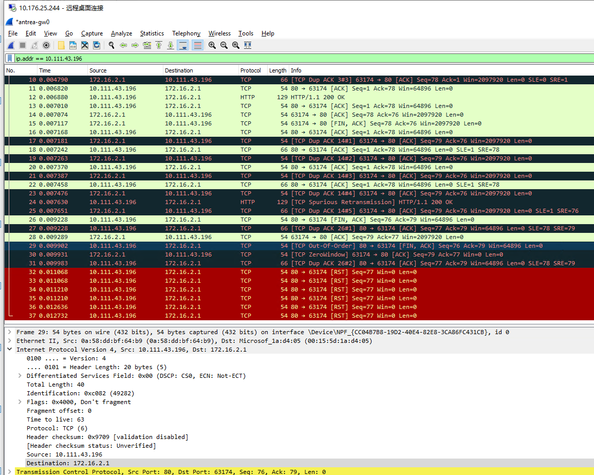

** ISSUE1 **

There're dup pkts. Captured pkts in `asset/clusterip_dup_issue.pcap`: 


May caused by GwCTMark and ServiceCTMark conflict.


Try to add flow to address the conflict.
```
c.pipeline[conntrackCommitTable].BuildFlow(priorityHigh).
    MatchProtocol(binding.ProtocolIP).
    MatchCTMark(serviceCTMark).
    MatchCTStateNew(true).
    MatchCTStateTrk(true).
    MatchRegRange(int(marksReg), markTrafficFromGateway, binding.Range{0, 15}).
    Action().GotoTable(L2ForwardingOutTable).
    Done()

ovs-ofctl add-flow br-int "table=105,cookie=0x520,priority=210,ct_state=+new+trk,ip,reg0=0x1/0xffff,ct_mark=0x21 actions=resubmit(,110)"

# ovs-ofctl add-flow br-int "table=105,cookie=0x520,priority=200,ct_state=+new+trk,ip,reg0=0x1/0xffff,ct_mark=0x21 actions=resubmit(,110)"
# ovs-ofctl del-flows br-int "table=105,cookie=0x520/-1,ct_state=+new+trk,ip,reg0=0x1/0xffff,ct_mark=0x21"
```


