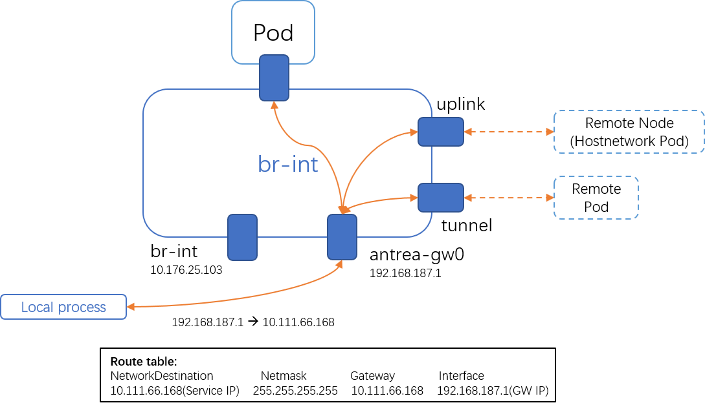

**Describe what you are trying to solve**

Support ClusterIP service access from host on Windows in antrea-proxy.

Currently, the access ClusterIP services on Windows node reply on kube-proxy. kube-proxy works in userspace which is inefficiency. We propose to remove kube-proxy and use antrea-proxy to handle the ClusterIP service access from host. We will get better performance and reduce the dependence to 3rd compoments in this way.


**Describe the solution you have in mind**

## Design

The endpoint selection/loadbalance for ClusterIP service has already been implemented. Changes proposed to be introduced to support ClusterIP service are to redirect the traffic from host to OVS bridge and leverage existing antrea-proxy pipeline:

1. Add route for service IPs to redirecto the traffic into OVS bridge through antrea-gw0.
2. Add ARP respondor flows for service IPs.
3. Add additional flows to make sure the traffic following expected path.

### 1. Add route for service IPs

Add route for service IPs like `$SVCIP via $GwIP dev antrea-gw0 onlink`. Then the connection to service IPs will be sent into OVS bridge through antrea-gw0 by host routing.

``` powershell
New-NetRoute -InterfaceAlias antrea-gw0 -DestinationPrefix $SVCIP/32 -NextHop $GWIP
```

### 2. Add ARP respondor flows for service IPs

ARP respondor flows are needed for service IPs.

``` powershell
ovs-ofctl add-flow br-int "table=20,cookie=$Cookie,priority=210,arp,arp_tpa=$SVCIP,arp_op=1 actions=move:NXM_OF_ETH_SRC[]->NXM_OF_ETH_DST[],mod_dl_src:$GwMac,load:0x2->NXM_OF_ARP_OP[],move:NXM_NX_ARP_SHA[]->NXM_NX_ARP_THA[],load:$GwMacHex->NXM_NX_ARP_SHA[],move:NXM_OF_ARP_SPA[]->NXM_OF_ARP_TPA[],load:$SVCIPHex->NXM_OF_ARP_SPA[],IN_PORT"
```



## ClusterIP service cases accessed from host

### 1. Endpoint is normal Pod

**(1) Encap && NoEncap(Endpoint is Pod)**

Expected path:

- Request: source process --> (GwIP, SVCIP) --> Gw --> DNAT(GwIP, PodIP) --> EndpointPod
- Reply: EndpointPod --> (PodIP, GwIP) --> unDNAT(SVIP, GwIP) --> gw --> source process

**(2) NoEncap(Endpoint is remotePod):**

Expected path:

- Request: source process --> (GwIP, SVCIP) --> Gw --> DNAT(GwIP, RemotePodIP) --> gw --> host(forward) --> br-int --> Uplink --> RemotePod
- Reply: (RemotePodIP, GwIP) --> unDNAT(SVCIP, GwIP) --> gw --> source process

### 2. Endpoint is hostnetwork mode

Expected path:

- Request: source process --> (GwIP, SVCIP) --> Gw --> DNAT(GwIP, RemoteNodeIP) --> SNAT(LocalNodeIP, RemoteNodeIP) --> gw --> host(forward) --> br-int --> Uplink --> RemoteNode
- Reply: (RemoteNodeIP, LocalNodeIP) --> Uplink --> unSNAT(RemoteNodeIP, GwIP) --> unDNAT(SVCIP, GwIP) --> gw --> source process


## Implementation example

``` powershell
# Add route: $SVCIP via $GwIP dev antrea-gw0 onlink
$SVCIP="10.111.66.168"
$GwIP="192.168.187.1"
New-NetRoute -InterfaceAlias antrea-gw0 -DestinationPrefix $SVCIP/32 -NextHop $SGWIP

# 2. Add arp respondor for svcip
$SVCIPHex="0xA6F42A8" # 10.111.66.168
$GwMac="00:15:5D:1A:D4:0D"
$GwMacHex="0x00155D1AD40D"
$Cookie="0x520"

# 3. ARP respondor flow for SVCIP
ovs-ofctl add-flow br-int "table=20,cookie=$Cookie,priority=210,arp,arp_tpa=$SVCIP,arp_op=1 actions=move:NXM_OF_ETH_SRC[]->NXM_OF_ETH_DST[],mod_dl_src:$GwMac,load:0x2->NXM_OF_ARP_OP[],move:NXM_NX_ARP_SHA[]->NXM_NX_ARP_THA[],load:$GwMacHex->NXM_NX_ARP_SHA[],move:NXM_OF_ARP_SPA[]->NXM_OF_ARP_TPA[],load:$SVCIPHex->NXM_OF_ARP_SPA[],IN_PORT"

# 4. Add flows on only for hostnetwork mode endpoints.
# In current pipeline, req pkt match:
#   cookie=0x2000000000000, duration=156115.590s, table=70, n_packets=6473, n_bytes=1990634, priority=0 actions=resubmit(,80)
# and will miss SNAT.
# Add flow to add SNAT required mark.
ovs-ofctl add-flow br-int "table=70,cookie=$Cookie,priority=190,ip,nw_src=$GwIP,ct_mark=0x21,reg0=0x1/0xffff,ct_mark=0x21 actions=load:0x1->NXM_NX_REG0[17],resubmit(,80)"
# Do SNAT for (GwIP, ExtNodeIPEndpoint)
ovs-ofctl add-flow br-int "table=105,cookie=$Cookie,priority=210,ip,nw_src=$GwIP,ct_state=+new+trk,reg0=0x1/0xffff,ct_mark=0x21,reg0=0x20000/0x20000 actions=ct(commit,table=110,zone=65500,nat(src=10.176.25.244),exec(load:0x40->NXM_NX_CT_MARK[]))"
ovs-ofctl add-flow br-int "table=105,cookie=$Cookie,priority=210,ip,nw_src=$GwIP,ct_state=-new+trk,reg0=0x1/0xffff,ct_mark=0x21,reg0=0x20000/0x20000 actions=ct(table=110,zone=65500,nat)"
# Since the request pks is recevied from GW and will be sent back to Gw for routing, so we need to use "in_port" which is required by OVS.
ovs-ofctl add-flow br-int "table=110,cookie=$Cookie,priority=210,ip,reg0=0x1/0xffff,reg0=0x20000/0x20000,reg1=0x2/0xffff actions=in_port"
```